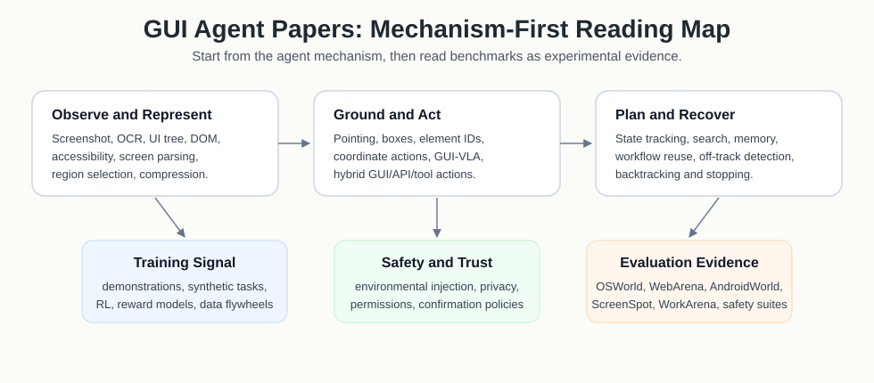

# Awesome GUI Agent  <!-- omit in toc -->

## [A Mechanism-First Reading Hub For GUI Agents](docs/gui-paper-landscape.md)
### :star: News! GUI Agents, Computer-Use Agents, and UI Automation Are Moving Fast

This repository curates papers, reports, projects, datasets, benchmarks, and infrastructure for Graphical User Interface (GUI) agents, computer-use agents (CUA), browser agents, mobile agents, and UI grounding.

The goal is not to mirror every new list. The goal is to keep a field-facing map of the mechanisms that make GUI agents work: screen representation, UI grounding, action modeling, planning, recovery, memory, trajectory generation, reward learning, safety, and execution infrastructure.

🔍 Key observations:

✅ **Grounding is still a central bottleneck.** Strong VLMs fail if they cannot localize actionable UI elements precisely.

✅ **Native GUI action models are scaling quickly.** Recent systems combine screenshot perception, action schemas, cross-platform data, and online RL.

✅ **Video demonstrations are becoming a major data source.** Screen recordings, tutorial videos, and execution videos connect GUI agents with temporal understanding and inverse dynamics.

✅ **Recovery and verification matter as much as first-step prediction.** Long-horizon GUI tasks need progress rewards, state tracking, backtracking, and guardrails.

✅ **Benchmarks are experimental substrates, not the research agenda.** Read them to understand evidence, action spaces, and failure modes, but start from GUI-agent mechanisms.

  

----

#### :books: How to read?
When reading a GUI-agent paper, first identify the paper family and mechanism:

✅ **Representation**: screenshot, OCR, accessibility tree, DOM, UI hierarchy, video, or mixed state.

✅ **Grounding**: coordinates, boxes, element IDs, UI regions, zooming, or parsing.

✅ **Action modeling**: low-level mouse and keyboard actions, structured GUI commands, tool calls, or hybrid actions.

✅ **Planning and recovery**: state tracking, progress estimation, backtracking, verification, and failure repair.

✅ **Learning signal**: demonstrations, synthetic trajectories, videos, reward models, RL, or self-improvement.

✅ **Safety model**: trust boundaries, confirmations, containment, audit logs, and adversarial UI behavior.

Benchmark and dataset papers are included because they reveal action spaces, failure labels, evaluation protocols, and reproducibility constraints. They should be read as evidence for mechanisms, not as the research agenda itself.

#### :card_index_dividers: Start here

| Goal | Entry Point |
| --- | --- |
| Understand the field structure | [GUI paper landscape](docs/gui-paper-landscape.md) |
| Choose a reading order | [Reading roadmap](docs/reading-roadmap.md) |
| Find high-priority method papers | [Method paper shortlist](docs/method-paper-shortlist.md) |
| Compare models, products, and infrastructure | [Model zoo and system map](docs/model-zoo.md) |
| Track academic papers and venues | [Academic paper map](docs/academic-papers.md), [venue index](docs/venue-index.md) |
| Track industry systems and APIs | [Industry technical reports](docs/industry-reports.md) |
| Develop research directions | [Research questions](docs/research-questions.md) |
| Understand source intake | [Source map](docs/source-map.md) |
| Add or review resources | [Contributing guide](CONTRIBUTING.md), [notes workflow](notes/) |

#### :high_brightness: This project is still on-going, pull requests are welcomed!!

If you find missing papers, reports, projects, datasets, or metadata errors, please open an issue or pull request. A title plus URL is already useful; deeper evaluation can go into `notes/`.

#### :star: If you find this repo useful, please star it!!!

## Table of Contents <!-- omit in toc -->
- [GUI Agent Surveys](#gui-agent-surveys)
- [GUI Representation & Grounding](#gui-representation--grounding)
- [Models & Agents](#models--agents)
- [Video Demonstrations & Trajectories](#video-demonstrations--trajectories)
- [Planning, Recovery & Memory](#planning-recovery--memory)
- [Training, RL & Reward Models](#training-rl--reward-models)
- [Safety & Trust](#safety--trust)
- [Products, APIs & Infrastructure](#products-apis--infrastructure)
- [Evaluation Substrates](#evaluation-substrates)
- [Related Awesome Lists](#related-awesome-lists)

### GUI Agent Surveys
+ **GUI-Agent-Survey-FM** [GUI Agents with Foundation Models: A Comprehensive Survey](https://arxiv.org/abs/2411.04890) (Nov. 2024)
  

+ **GUI-Agent-Survey** [GUI Agents: A Survey](https://arxiv.org/abs/2412.13501) (Dec. 2024)
  

+ **OS-Agents-Survey** [OS Agents: A Survey on MLLM-based Agents for Computer, Phone and Browser Use](https://aclanthology.org/2025.acl-long.369/) (Jul. 2025, ACL 2025)
  

+ **Trustworthy-GUI-Agents** [Towards Trustworthy GUI Agents: A Survey](https://arxiv.org/abs/2503.23434) (Mar. 2025)
  

### GUI Representation & Grounding
+ **ScreenAI** [ScreenAI: A Vision-Language Model for UI and Infographics Understanding](https://www.ijcai.org/proceedings/2024/339) (Aug. 2024, IJCAI 2024)
  

+ **Ferret-UI** [Ferret-UI: Grounded Mobile UI Understanding with Multimodal LLMs](https://eccv.ecva.net/virtual/2024/poster/749) (Sep. 2024, ECCV 2024)
  

+ **OmniParser** [OmniParser for Pure Vision Based GUI Agent](https://github.com/microsoft/OmniParser) (Aug. 2024)
  
  

+ **SeeClick** [SeeClick: Harnessing GUI Grounding for Advanced Visual GUI Agents](https://github.com/njucckevin/SeeClick) (Jul. 2024, ACL 2024)
  
  

+ **OS-ATLAS** [OS-ATLAS: A Foundation Action Model for Generalist GUI Agents](https://github.com/OS-Copilot/OS-Atlas) (Apr. 2025, ICLR 2025 Spotlight)
  
  

+ **ShowUI** [ShowUI: One Vision-Language-Action Model for GUI Visual Agent](https://github.com/showlab/ShowUI) (Jun. 2025, CVPR 2025)
  
  

+ **ScreenSpot-Pro** [ScreenSpot-Pro: GUI Grounding for Professional High-Resolution Computer Use](https://github.com/likaixin2000/ScreenSpot-Pro-GUI-Grounding) (Apr. 2025)
  
  

+ **GUI-G1** [GUI-G1: Understanding R1-Zero-Like Training for Visual Grounding in GUI Agents](https://arxiv.org/abs/2505.15810) (May. 2025)
  

+ **ReGUIDE** [ReGUIDE: Data Efficient GUI Grounding via Spatial Reasoning and Test-time Scaling](https://arxiv.org/abs/2505.15259) (May. 2025)
  

### Models & Agents
+ **Agent-S** [Agent S: An Open Agentic Framework that Uses Computers Like a Human](https://proceedings.iclr.cc/paper_files/paper/2025/hash/394c7c30ea87b5c3521b4d9e9d419071-Abstract-Conference.html) (Apr. 2025, ICLR 2025)
  

+ **Aguvis** [Aguvis: Unified Pure Vision Agents for Autonomous GUI Interaction](https://proceedings.mlr.press/v267/xu25ae.html) (Jul. 2025, ICML 2025)
  

+ **OpenCUA** [OpenCUA: Open Foundations for Computer-Use Agents](https://github.com/xlang-ai/OpenCUA) (Aug. 2025)
  

+ **UI-TARS** [UI-TARS: Pioneering Automated GUI Interaction with Native Agents](https://github.com/bytedance/UI-TARS) (Jan. 2025)
  
  

+ **UI-TARS-2** [UI-TARS-2 Technical Report](https://arxiv.org/abs/2509.02544) (Sep. 2025)
  

+ **ScaleCUA** [ScaleCUA: Scaling Open-Source Computer Use Agents with Cross-Platform Data](https://github.com/OpenGVLab/ScaleCUA) (Sep. 2025)
  
  

+ **Mobile-Agent-v3** [Mobile-Agent-v3: Fundamental Agents for GUI Automation](https://arxiv.org/abs/2508.15144) (Aug. 2025)
  

+ **AutoGLM** [AutoGLM: Autonomous Foundation Agents for GUIs](https://arxiv.org/abs/2411.00820) (Nov. 2024)
  

+ **Magentic-UI** [Magentic-UI: Towards Human-in-the-loop Agentic Systems](https://arxiv.org/abs/2507.22358) (Jul. 2025, Microsoft Research)
  

### Video Demonstrations & Trajectories
+ **CUA-Suite** [CUA-Suite: Massive Human-annotated Video Demonstrations for Computer-Use Agents](https://arxiv.org/abs/2603.24440) (Mar. 2026)
  

+ **ExeVRM** [Video-Based Reward Modeling for Computer-Use Agents](https://arxiv.org/abs/2603.10178) (Mar. 2026)
  

+ **ShowUI-Aloha** [ShowUI-Aloha: Human-Taught GUI Agent](https://arxiv.org/abs/2601.07181) (Jan. 2026)
  

+ **VideoAgentTrek** [VideoAgentTrek: Computer Use Pretraining from Unlabeled Videos](https://arxiv.org/abs/2510.19488) (Oct. 2025)
  

+ **Watch-and-Learn** [Watch and Learn: Learning to Use Computers from Online Videos](https://arxiv.org/abs/2510.04673) (Oct. 2025, CVPR 2026)
  

+ **VideoWebArena** [VideoWebArena: Evaluating Long Context Multimodal Agents with Video Understanding Web Tasks](https://proceedings.iclr.cc/paper_files/paper/2025/hash/5b555804d495321df2e3208cc27f4fbc-Abstract-Conference.html) (Apr. 2025, ICLR 2025)
  

+ **VideoGUI** [VideoGUI: A Benchmark for GUI Automation from Instructional Videos](https://proceedings.neurips.cc/paper_files/paper/2024/hash/804e757b7d7043c26701c3a313032101-Abstract-Datasets_and_Benchmarks_Track.html) (Dec. 2024, NeurIPS 2024 Datasets and Benchmarks)
  

+ **GUI-KV** [GUI-KV: Efficient GUI Agents via KV Cache with Spatio-Temporal Awareness](https://arxiv.org/abs/2510.00536) (Oct. 2025)
  

### Planning, Recovery & Memory
+ **WebDreamer** [Is Your LLM Secretly a World Model of the Internet? Model-Based Planning for Web Agents](https://openreview.net/forum?id=c6l7yA0HSq) (Jul. 2025, ICML 2025)
  

+ **BacktrackAgent** [BacktrackAgent: Enhancing GUI Agent with Error Detection and Backtracking Mechanism](https://arxiv.org/abs/2505.20660) (May. 2025, EMNLP 2025 Oral)
  

+ **ExACT** [ExACT: Teaching AI Agents to Explore with Reflective-MCTS and Exploratory Learning](https://proceedings.iclr.cc/paper_files/paper/2025/hash/a3b893ba1de12f76020b03f7ae8e1afd-Abstract-Conference.html) (Apr. 2025, ICLR 2025)
  

+ **Agent-Workflow-Memory** [Agent Workflow Memory](https://proceedings.mlr.press/v267/wang25bx.html) (Jul. 2025, ICML 2025)
  

+ **GUI-explorer** [GUI-explorer: Autonomous Exploration and Mining of Transition-aware Knowledge for GUI Agent](https://aclanthology.org/2025.acl-long.282/) (Jul. 2025, ACL 2025)
  

+ **Synapse** [Synapse: Trajectory-as-Exemplar Prompting with Memory for Computer Control](https://arxiv.org/abs/2306.07863) (Jan. 2024, ICLR 2024)
  

+ **MobileDreamer** [MobileDreamer: Generative Sketch World Model for GUI Agent](https://arxiv.org/abs/2601.04035) (Jan. 2026)
  

+ **Code2World** [Code2World: A GUI World Model via Renderable Code Generation](https://arxiv.org/abs/2602.09856) (Feb. 2026)
  

+ **DynaWeb** [DynaWeb: Model-Based Reinforcement Learning of Web Agents](https://arxiv.org/abs/2601.22149) (Jan. 2026)
  

### Training, RL & Reward Models
+ **ComputerRL** [ComputerRL: Scaling End-to-End Online Reinforcement Learning for Computer Use Agents](https://arxiv.org/abs/2508.14040) (Aug. 2025)
  

+ **MobileRL** [MobileRL: Online Agentic Reinforcement Learning for Mobile GUI Agents](https://arxiv.org/abs/2509.18119) (Sep. 2025)
  

+ **Web-Shepherd** [Web-Shepherd: Advancing PRMs for Reinforcing Web Agents](https://arxiv.org/abs/2505.15277) (May. 2025, NeurIPS 2025 Spotlight)
  

+ **ProgRM** [ProgRM: Multi-Agent Programmatic Reward Model for GUI Agents](https://arxiv.org/abs/2505.18121) (May. 2025)
  

+ **WebAgent-R1** [WebAgent-R1: Training Web Agents via End-to-End Multi-Turn Reinforcement Learning](https://arxiv.org/abs/2505.16421) (May. 2025, EMNLP 2025)
  

+ **WebRL** [WebRL: Training LLM Web Agents via Self-Evolving Online Curriculum Reinforcement Learning](https://openreview.net/forum?id=oVKEAFjEqv) (Apr. 2025, ICLR 2025)
  

+ **DigiRL** [DigiRL: Training In-The-Wild Device-Control Agents with Autonomous Reinforcement Learning](https://proceedings.neurips.cc/paper_files/paper/2024/hash/1704ddd0bb89f159dfe609b32c889995-Abstract-Conference.html) (Dec. 2024, NeurIPS 2024)
  

+ **OS-Genesis** [OS-Genesis: Automating GUI Agent Trajectory Construction via Reverse Task Synthesis](https://aclanthology.org/2025.acl-long.277/) (Jul. 2025, ACL 2025)
  

+ **ANCHOR** [ANCHOR: Branch-point Trajectory Expansion for GUI-Agent Data Generation](https://arxiv.org/abs/2602.07153) (Feb. 2026)
  

### Safety & Trust
+ **RedTeamCUA** [RedTeamCUA: Realistic Adversarial Testing of Computer-Use Agents in Hybrid Web-OS Environments](https://github.com/OSU-NLP-Group/RedTeamCUA) (2026)
  

+ **OS-HARM** [OS-HARM: A Benchmark for Measuring Safety of Computer Use Agents](https://github.com/tml-epfl/os-harm) (Mar. 2025, NeurIPS 2025 Datasets and Benchmarks Spotlight)
  
  

+ **AgentDAM** [AgentDAM: Privacy Leakage Evaluation for Autonomous Web Agents](https://arxiv.org/abs/2503.09780) (Mar. 2025, NeurIPS 2025)
  

+ **Pop-up-Attack** [Attacking Vision-Language Computer Agents via Pop-ups](https://aclanthology.org/2025.acl-long.411/) (Jul. 2025, ACL 2025)
  

+ **EIA** [Environmental Injection Attack on Generalist Web Agents for Privacy Leakage](https://openreview.net/forum?id=xMOLUzo2Lk) (Apr. 2025, ICLR 2025)
  

+ **ST-WebAgentBench** [ST-WebAgentBench: A Benchmark for Evaluating Safety and Trustworthiness in Web Agents](https://openreview.net/forum?id=MuCDzH0ctf) (Apr. 2025, ICLR 2025)
  

+ **Progent** [Progent: Programmable Privilege Control for LLM Agents](https://arxiv.org/abs/2504.11703) (Apr. 2025)
  

+ **SafePred** [SafePred: A Predictive Guardrail for Computer-Using Agents via World Models](https://arxiv.org/abs/2602.01725) (Feb. 2026)
  

### Products, APIs & Infrastructure
+ **OpenAI-CUA** [OpenAI Computer-Using Agent](https://openai.com/index/computer-using-agent/) (Jan. 2025)
  

+ **OpenAI-CUA-Sample-App** [OpenAI CUA Sample App](https://github.com/openai/openai-cua-sample-app) (2025)
  

+ **Anthropic-Computer-Use** [Claude 3.5 Models and Computer Use](https://www.anthropic.com/news/3-5-models-and-computer-use) (Oct. 2024)
  

+ **Project-Mariner** [Project Mariner](https://blog.google/innovation-and-ai/models-and-research/google-deepmind/google-gemini-ai-update-december-2024/) (Dec. 2024)
  

+ **trycua** [cua: Computer-Use Agent Infrastructure](https://github.com/trycua/cua) (2025)
  

+ **BrowserGym** [The BrowserGym Ecosystem for Web Agent Research](https://openreview.net/forum?id=5298fKGmv3) (2025, TMLR)
  

+ **UI-TARS-Desktop** [UI-TARS Desktop](https://github.com/bytedance/UI-TARS-desktop) (2025)
  

### Evaluation Substrates
+ **OSWorld** [OSWorld: Benchmarking Multimodal Agents for Open-Ended Tasks in Real Computer Environments](https://github.com/xlang-ai/OSWorld) (Dec. 2024, NeurIPS 2024 Datasets and Benchmarks)
  

+ **WebArena** [WebArena: A Realistic Web Environment for Building Autonomous Agents](https://github.com/web-arena-x/webarena) (Jan. 2024, ICLR 2024)
  

+ **VisualWebArena** [VisualWebArena: Evaluating Multimodal Agents on Realistic Visual Web Tasks](https://aclanthology.org/2024.acl-long.50/) (Aug. 2024, ACL 2024)
  

+ **AndroidWorld** [AndroidWorld: A Dynamic Benchmarking Environment for Autonomous Agents](https://github.com/google-research/android_world) (Apr. 2025, ICLR 2025)
  

+ **WorkArena** [WorkArena: How Capable are Web Agents at Solving Common Knowledge Work Tasks?](https://proceedings.mlr.press/v235/drouin24a.html) (Jul. 2024, ICML 2024)
  

+ **Windows-Agent-Arena** [Windows Agent Arena: Evaluating Multi-Modal OS Agents at Scale](https://github.com/microsoft/WindowsAgentArena) (Jul. 2025, ICML 2025)
  

+ **OSWorld-G** [OSWorld-G](https://github.com/xlang-ai/OSWorld-G) (May. 2025)
  

### Related Awesome Lists
+ **Awesome-GUI-Agent** [showlab/Awesome-GUI-Agent](https://github.com/showlab/Awesome-GUI-Agent)
  

+ **GUI-Agents-Paper-List** [OSU-NLP-Group/GUI-Agents-Paper-List](https://github.com/OSU-NLP-Group/GUI-Agents-Paper-List)
  

+ **Awesome-GUI-Agents** [ZJU-REAL/Awesome-GUI-Agents](https://github.com/ZJU-REAL/Awesome-GUI-Agents)
  

+ **Awesome-GUI-Agent-Safety** [Autonomous-Agent-Team/Awesome-GUI-Agent-Safety](https://github.com/Autonomous-Agent-Team/Awesome-GUI-Agent-Safety)
  

+ **Awesome-Computer-Use-Agents** [cdxeve/awesome-computer-use-agents](https://github.com/cdxeve/awesome-computer-use-agents)
  
